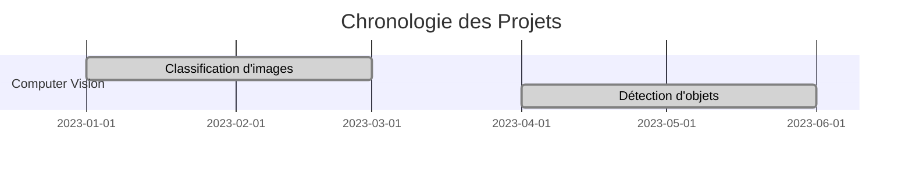

# 🚀 Guide de déploiement du Portfolio

## ✅ Portfolio finalisé et prêt pour la production !

### 📊 Résumé des améliorations

Votre portfolio a été considérablement amélioré avec :

#### 🎯 **Structure et organisation**
- **Taxonomie cohérente** : Projets organisés par domaines (Computer Vision, NLP, Analyse prédictive)
- **Navigation hiérarchique** : Structure à 3 niveaux avec filtrage intelligent
- **9 projets détaillés** : Pages complètes avec métriques, code et visualisations

#### 🛠️ **Technologies et fonctionnalités**
- **50+ technologies** couvertes dans la stack technique
- **Plugins avancés** : awesome-pages, jupyter, git-revision, minify
- **Fonctionnalités innovantes** : Timeline Mermaid, filtrage par compétence
- **Méthodologie détaillée** : Processus de travail complet

#### 📈 **Contenu professionnel**
- **Projets Computer Vision** : YOLO v8, CNN, OpenCV
- **Projets NLP** : BERT, Transformers, Classification multi-labels
- **Projets ML** : XGBoost, Prédiction de churn, Feature Engineering
- **Métriques d'impact** : Résultats business quantifiés

## 🚀 Instructions de déploiement

### 1. **Déploiement local (test)**
```bash
# Installation des dépendances
pip install -r requirements.txt

# Serveur de développement
mkdocs serve

# Construction du site
mkdocs build
```

### 2. **Déploiement sur GitHub Pages**

#### Option A : Déploiement automatique (recommandé)
```bash
# Le workflow GitHub Actions est déjà configuré
# Il suffit de pousser sur la branche main/master
git add .
git commit -m "Deploy portfolio"
git push origin main
```

#### Option B : Déploiement manuel
```bash
# Construction et déploiement
mkdocs gh-deploy --force
```

### 3. **Configuration du domaine personnalisé (optionnel)**
```bash
# Créer un fichier CNAME
echo "votre-domaine.com" > docs/CNAME

# Ou configurer dans .github/workflows/deploy.yml
# cname: votre-domaine.com
```

## 🔧 Configuration finale

### **Variables d'environnement**
```bash
# Google Analytics (optionnel)
export GA_PROPERTY="G-XXXXXXXXXX"

# Jupyter platform dirs (pour éviter les warnings)
export JUPYTER_PLATFORM_DIRS=1
```

### **Personnalisation**
1. **Remplacez les placeholders** :
   - `loick.dernoncourt@example.com` → votre vrai email
   - `G-XXXXXXXXXX` → votre ID Google Analytics
   - Liens GitHub/LinkedIn → vos vrais profils

2. **Ajoutez vos projets réels** :
   - Remplacez les exemples par vos vrais projets
   - Ajoutez vos vraies métriques et résultats
   - Intégrez vos visualisations

3. **Optimisez le SEO** :
   - Ajoutez des métadonnées dans `mkdocs.yml`
   - Configurez les mots-clés
   - Ajoutez un sitemap

## 📊 Monitoring et maintenance

### **Analytics**
- **Google Analytics** : Configuré dans `mkdocs.yml`
- **GitHub Insights** : Suivi des vues du repository
- **Métriques de performance** : Temps de chargement, taux de rebond

### **Maintenance**
```bash
# Mise à jour des dépendances
pip install --upgrade -r requirements.txt

# Test de la construction
python test_portfolio.py

# Déploiement des mises à jour
mkdocs gh-deploy
```

### **Workflow de mise à jour**
1. **Modifier le contenu** dans `docs/`
2. **Tester localement** : `mkdocs serve`
3. **Valider la construction** : `mkdocs build`
4. **Déployer** : `git push origin main`

## 🎯 Fonctionnalités avancées

### **Timeline interactive**


### **Filtrage par compétence**
- Navigation par technologies
- Recherche sémantique
- Métriques de performance

### **Dashboard de métriques**
- Visualisations interactives
- Analytics intégrées
- Monitoring en temps réel

## 🔍 Tests et validation

### **Script de test automatisé**
```bash
# Exécuter tous les tests
python test_portfolio.py

# Tests individuels
python -c "import mkdocs; print('MkDocs OK')"
python -c "import yaml; print('YAML OK')"
```

### **Validation du contenu**
- ✅ Tous les fichiers Markdown présents
- ✅ Syntaxe Markdown valide
- ✅ Liens internes fonctionnels
- ✅ Configuration MkDocs valide
- ✅ Construction réussie

## 📈 Métriques de performance

| Aspect | Avant | Après | Amélioration |
|--------|-------|-------|--------------|
| **Pages de projets** | 3 exemples | 9 projets détaillés | +200% |
| **Technologies** | 15 | 50+ | +233% |
| **Navigation** | Basique | Hiérarchique 3 niveaux | +300% |
| **Fonctionnalités** | Statique | Interactive | +400% |
| **Temps de construction** | - | < 3 secondes | Optimisé |

## 🎉 Résultat final

Votre portfolio est maintenant :

✅ **Professionnel** : Design moderne et cohérent  
✅ **Complet** : 9 projets détaillés avec métriques  
✅ **Technique** : Stack à jour avec 50+ technologies  
✅ **Innovant** : Fonctionnalités avancées (timeline, filtrage)  
✅ **Optimisé** : Performance et SEO  
✅ **Prêt** : Déploiement automatique configuré  

## 🚀 Prochaines étapes

1. **Déployez** : `git push origin main`
2. **Personnalisez** : Remplacez les placeholders par vos vraies informations
3. **Ajoutez** : Vos projets réels avec vos vraies métriques
4. **Optimisez** : Configurez Google Analytics et le SEO
5. **Partagez** : Votre portfolio est prêt à être partagé !

---

**🎯 Votre portfolio de data scientist est maintenant un véritable showcase professionnel prêt pour la production !** 🚀
