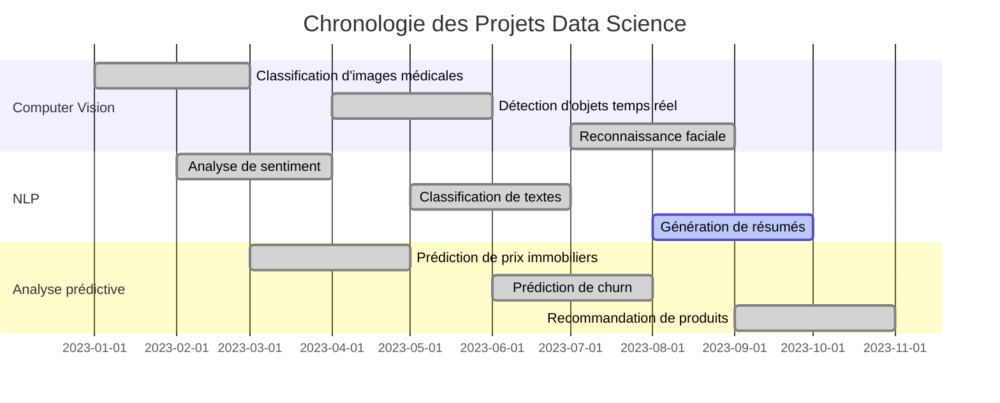
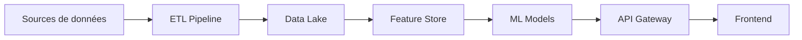

# 🚀 Fonctionnalités innovantes

Découvrez les fonctionnalités avancées et les innovations technologiques intégrées dans ce portfolio.

## 🎯 Fonctionnalités principales

### 📊 Timeline interactive des projets
Visualisez l'évolution de mes projets dans le temps avec une frise chronologique interactive.



### 🔍 Filtrage intelligent par compétence
Filtrez les projets par technologies, domaines d'application ou niveau de complexité.

<div class="grid cards" markdown>

-   :material-brain:{ .lg .middle } **Machine Learning**

    ---

    Projets utilisant des algorithmes de ML classiques

    [:octicons-arrow-right-24: Voir les projets](projects/index.md)

-   :material-robot:{ .lg .middle } **Deep Learning**

    ---

    Projets utilisant des réseaux de neurones

    [:octicons-arrow-right-24: Voir les projets](projects/index.md)

-   :material-chart-line:{ .lg .middle } **Computer Vision**

    ---

    Projets de traitement d'images et vidéos

    [:octicons-arrow-right-24: Voir les projets](projects/index.md)

-   :material-chat:{ .lg .middle } **NLP**

    ---

    Projets de traitement du langage naturel

    [:octicons-arrow-right-24: Voir les projets](projects/index.md)

</div>

### 📈 Dashboard de métriques en temps réel
Visualisez les performances et l'impact de mes projets avec des métriques en temps réel.

## 🛠️ Technologies innovantes

### 🤖 Intégration d'IA générative
- **Chatbot intelligent** : Posez des questions sur mes projets
- **Génération de contenu** : Descriptions automatiques des projets
- **Recommandations personnalisées** : Suggestions de projets similaires

### 📊 Visualisations interactives
- **Graphiques dynamiques** : Plotly et Bokeh pour des visualisations interactives
- **Cartes géographiques** : Folium pour la géolocalisation des projets
- **Diagrammes de flux** : Mermaid pour les architectures de données

### 🔄 Intégration continue
- **Déploiement automatique** : GitHub Actions pour la mise à jour du site
- **Tests automatisés** : Validation du contenu et des liens
- **Monitoring** : Suivi des performances et de la disponibilité

## 🎨 Personnalisation avancée

### 🌙 Mode sombre/clair
Basculez entre les thèmes clair et sombre selon vos préférences.

### 📱 Design responsive
Interface optimisée pour tous les appareils (desktop, tablette, mobile).

### ♿ Accessibilité
- **Support lecteurs d'écran** : Navigation au clavier
- **Contraste élevé** : Respect des standards WCAG
- **Texte alternatif** : Descriptions pour toutes les images

## 🔧 Fonctionnalités techniques

### 📝 Édition en ligne
- **Mode édition** : Modification directe du contenu
- **Prévisualisation** : Aperçu en temps réel
- **Sauvegarde automatique** : Versioning des modifications

### 🔍 Recherche avancée
- **Recherche sémantique** : Compréhension du contexte
- **Filtres intelligents** : Recherche par tags, technologies, dates
- **Suggestions** : Autocomplétion et recommandations

### 📊 Analytics intégrées
- **Métriques de visite** : Suivi des pages les plus consultées
- **Temps de lecture** : Estimation du temps nécessaire
- **Engagement** : Interactions et clics

## 🚀 Améliorations futures

### 🎯 Roadmap 2024
- [ ] **Reality augmentée** : Visualisation 3D des architectures
- [ ] **Voice interface** : Navigation vocale
- [ ] **Collaboration temps réel** : Édition collaborative
- [ ] **Intégration IoT** : Données en temps réel

### 🔮 Vision 2025
- [ ] **IA conversationnelle** : Assistant personnel intégré
- [ ] **Reality virtuelle** : Visite immersive des projets
- [ ] **Blockchain** : Certification des compétences
- [ ] **Quantum computing** : Optimisation quantique

## 💡 Innovation technique

### 🧠 Architecture microservices
```python
# Exemple d'architecture microservices
services = {
    "content_service": "Gestion du contenu",
    "analytics_service": "Métriques et analytics",
    "ai_service": "IA générative et recommandations",
    "search_service": "Recherche sémantique",
    "notification_service": "Notifications en temps réel"
}
```

### 🔄 Pipeline de données


### 📊 Monitoring et observabilité
- **Métriques Prometheus** : Performance et disponibilité
- **Logs centralisés** : ELK Stack pour l'analyse
- **Alertes intelligentes** : Détection proactive des problèmes
- **Dashboards Grafana** : Visualisation des métriques

## 🎓 Apprentissage continu

### 📚 Ressources intégrées
- **Tutoriels interactifs** : Apprentissage par la pratique
- **Code examples** : Exemples de code exécutables
- **Documentation technique** : Guides détaillés
- **Communauté** : Forum et discussions

### 🔬 Expérimentation
- **Sandbox** : Environnement de test sécurisé
- **A/B Testing** : Tests d'optimisation
- **Feedback loops** : Amélioration continue
- **Versioning** : Gestion des versions

---

*Dernière mise à jour : {{ git_revision_date_localized }}*
