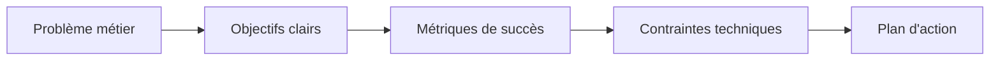
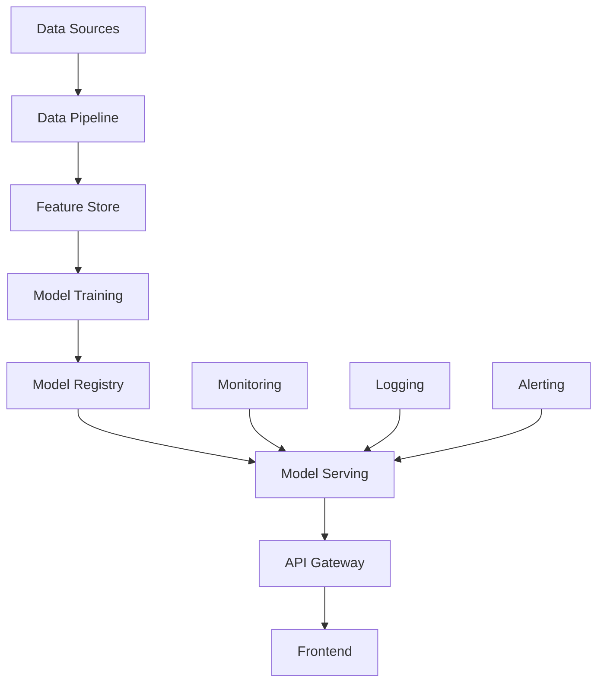

# 🔬 Méthodologie de travail

Découvrez ma démarche méthodologique pour mener à bien des projets de data science, de la conception à la mise en production.

## 🎯 Approche méthodologique

### 1. **Compréhension du problème métier**


**Étapes clés :**
- **Stakeholder interviews** : Compréhension des besoins réels
- **Définition des objectifs** : SMART (Spécifique, Mesurable, Atteignable, Réaliste, Temporel)
- **Métriques de succès** : KPIs business et techniques
- **Analyse des contraintes** : Temps, budget, données, réglementation

### 2. **Exploration et compréhension des données**
```python
# Pipeline d'exploration des données
def explore_data(data):
    """Pipeline complet d'exploration des données"""
    
    # 1. Vue d'ensemble
    print("=== VUE D'ENSEMBLE ===")
    print(f"Shape: {data.shape}")
    print(f"Types: {data.dtypes}")
    print(f"Missing values: {data.isnull().sum()}")
    
    # 2. Statistiques descriptives
    print("\n=== STATISTIQUES ===")
    print(data.describe())
    
    # 3. Analyse de la qualité
    print("\n=== QUALITÉ DES DONNÉES ===")
    quality_report = analyze_data_quality(data)
    
    # 4. Visualisations exploratoires
    create_exploratory_plots(data)
    
    return quality_report
```

**Outils utilisés :**
- **Pandas Profiling** : Rapport automatique de qualité
- **Sweetviz** : Analyse comparative des datasets
- **Matplotlib/Seaborn** : Visualisations personnalisées
- **Plotly** : Graphiques interactifs

### 3. **Feature Engineering et préprocessing**
```python
class DataPreprocessor:
    def __init__(self):
        self.scalers = {}
        self.encoders = {}
        self.feature_selector = None
    
    def create_features(self, df):
        """Création de features métier"""
        # Features temporelles
        df['year'] = df['date'].dt.year
        df['month'] = df['date'].dt.month
        df['day_of_week'] = df['date'].dt.dayofweek
        
        # Features d'interaction
        df['feature_ratio'] = df['var1'] / df['var2']
        df['feature_product'] = df['var1'] * df['var2']
        
        # Features statistiques
        df['rolling_mean_7d'] = df['value'].rolling(7).mean()
        df['rolling_std_7d'] = df['value'].rolling(7).std()
        
        return df
    
    def handle_missing_values(self, df, strategy='intelligent'):
        """Gestion intelligente des valeurs manquantes"""
        if strategy == 'intelligent':
            # Analyse des patterns de manquants
            missing_patterns = analyze_missing_patterns(df)
            
            # Imputation adaptée
            for col in df.columns:
                if df[col].dtype in ['int64', 'float64']:
                    df[col].fillna(df[col].median(), inplace=True)
                else:
                    df[col].fillna(df[col].mode()[0], inplace=True)
        
        return df
```

### 4. **Modélisation et validation**
```python
class ModelPipeline:
    def __init__(self):
        self.models = {}
        self.results = {}
    
    def train_models(self, X_train, y_train):
        """Entraînement de plusieurs modèles"""
        models = {
            'Random Forest': RandomForestClassifier(n_estimators=100),
            'XGBoost': XGBClassifier(n_estimators=100),
            'LightGBM': LGBMClassifier(n_estimators=100),
            'Neural Network': MLPClassifier(hidden_layer_sizes=(100, 50))
        }
        
        for name, model in models.items():
            # Entraînement
            model.fit(X_train, y_train)
            self.models[name] = model
            
            # Validation croisée
            cv_scores = cross_val_score(model, X_train, y_train, cv=5)
            self.results[name] = {
                'cv_mean': cv_scores.mean(),
                'cv_std': cv_scores.std(),
                'model': model
            }
    
    def optimize_hyperparameters(self, model, X_train, y_train):
        """Optimisation des hyperparamètres avec Optuna"""
        def objective(trial):
            params = {
                'n_estimators': trial.suggest_int('n_estimators', 100, 1000),
                'max_depth': trial.suggest_int('max_depth', 3, 10),
                'learning_rate': trial.suggest_float('learning_rate', 0.01, 0.3)
            }
            
            model.set_params(**params)
            score = cross_val_score(model, X_train, y_train, cv=5).mean()
            return score
        
        study = optuna.create_study(direction='maximize')
        study.optimize(objective, n_trials=100)
        
        return study.best_params
```

### 5. **Évaluation et interprétation**
```python
class ModelEvaluator:
    def __init__(self):
        self.metrics = {}
        self.explanations = {}
    
    def comprehensive_evaluation(self, model, X_test, y_test):
        """Évaluation complète du modèle"""
        # Prédictions
        y_pred = model.predict(X_test)
        y_pred_proba = model.predict_proba(X_test)[:, 1]
        
        # Métriques de performance
        metrics = {
            'accuracy': accuracy_score(y_test, y_pred),
            'precision': precision_score(y_test, y_pred),
            'recall': recall_score(y_test, y_pred),
            'f1': f1_score(y_test, y_pred),
            'auc_roc': roc_auc_score(y_test, y_pred_proba)
        }
        
        # Analyse des erreurs
        error_analysis = self.analyze_errors(y_test, y_pred, X_test)
        
        # Explicabilité
        if hasattr(model, 'feature_importances_'):
            feature_importance = self.get_feature_importance(model, X_test)
        else:
            feature_importance = self.shap_analysis(model, X_test)
        
        return {
            'metrics': metrics,
            'error_analysis': error_analysis,
            'feature_importance': feature_importance
        }
    
    def shap_analysis(self, model, X_test):
        """Analyse SHAP pour l'explicabilité"""
        explainer = shap.TreeExplainer(model)
        shap_values = explainer.shap_values(X_test)
        
        return {
            'shap_values': shap_values,
            'feature_names': X_test.columns.tolist(),
            'summary_plot': shap.summary_plot(shap_values, X_test)
        }
```

## 🚀 Déploiement et MLOps

### 1. **Architecture de production**


### 2. **Pipeline CI/CD**
```yaml
# .github/workflows/ml-pipeline.yml
name: ML Pipeline

on:
  push:
    branches: [ main ]
    paths: [ 'models/**', 'data/**' ]

jobs:
  train-model:
    runs-on: ubuntu-latest
    steps:
    - uses: actions/checkout@v3
    
    - name: Set up Python
      uses: actions/setup-python@v4
      with:
        python-version: '3.11'
    
    - name: Install dependencies
      run: pip install -r requirements.txt
    
    - name: Run tests
      run: pytest tests/
    
    - name: Train model
      run: python scripts/train_model.py
    
    - name: Evaluate model
      run: python scripts/evaluate_model.py
    
    - name: Deploy model
      if: success()
      run: python scripts/deploy_model.py
```

### 3. **Monitoring et observabilité**
```python
class ModelMonitor:
    def __init__(self):
        self.metrics = {}
        self.alerts = []
    
    def monitor_data_drift(self, current_data, reference_data):
        """Détection de dérive des données"""
        from evidently import ColumnMapping
        from evidently.report import Report
        from evidently.metric_preset import DataDriftPreset
        
        report = Report(metrics=[DataDriftPreset()])
        report.run(
            reference_data=reference_data,
            current_data=current_data
        )
        
        return report
    
    def monitor_model_performance(self, y_true, y_pred):
        """Monitoring des performances du modèle"""
        current_accuracy = accuracy_score(y_true, y_pred)
        
        # Comparaison avec baseline
        if current_accuracy < self.baseline_accuracy * 0.95:
            self.send_alert("Model performance degraded")
        
        return current_accuracy
    
    def send_alert(self, message):
        """Envoi d'alertes"""
        # Intégration avec Slack, email, PagerDuty
        pass
```

## 📊 Outils et technologies

### **Environnement de développement**
- **IDE** : VS Code avec extensions Python, Jupyter
- **Versioning** : Git + DVC pour les données
- **Environnement** : Conda/Poetry pour la gestion des dépendances
- **Notebooks** : Jupyter Lab avec extensions

### **Pipeline de données**
- **ETL** : Apache Airflow, Prefect
- **Storage** : S3, HDFS, PostgreSQL
- **Processing** : Pandas, Spark, Dask
- **Feature Store** : Feast, Tecton

### **Machine Learning**
- **Frameworks** : Scikit-learn, XGBoost, PyTorch, TensorFlow
- **MLOps** : MLflow, Kubeflow, Weights & Biases
- **Monitoring** : Evidently, WhyLabs, Neptune

### **Déploiement**
- **Conteneurisation** : Docker, Kubernetes
- **APIs** : FastAPI, Flask, Django
- **Cloud** : AWS, GCP, Azure
- **Monitoring** : Prometheus, Grafana, ELK Stack

## 🎯 Bonnes pratiques

### **Code et documentation**
- **Documentation** : Docstrings, README, architecture decisions
- **Tests** : Unit tests, integration tests, model tests
- **Code review** : Pull requests, pair programming
- **Standards** : PEP 8, type hints, linting

### **Gestion des données**
- **Privacy** : Anonymisation, pseudonymisation
- **Security** : Chiffrement, accès contrôlé
- **Compliance** : RGPD, audit trails
- **Backup** : Stratégies de sauvegarde et récupération

### **Collaboration**
- **Communication** : Stand-ups, retrospectives
- **Knowledge sharing** : Tech talks, documentation
- **Mentoring** : Pair programming, code reviews
- **Continuous learning** : Cours, conférences, certifications

---

*Cette méthodologie garantit la qualité, la reproductibilité et l'impact business de mes projets de data science.*
